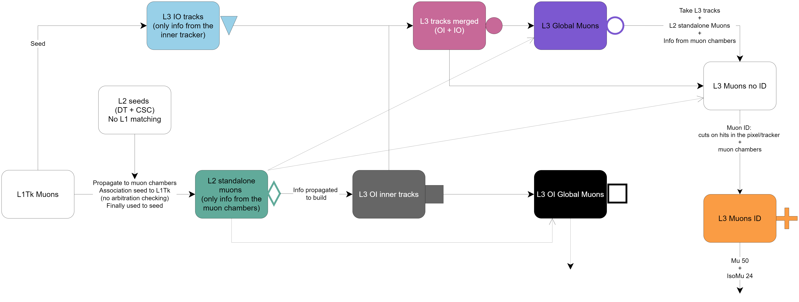

# Phase 2 HLT Muon objects and workflow
All paths in the current Phase 2 menu use the same algorithms to reconstruct muons, with some of them producing slightly fewer collections than others. 
To the best of the current knowledge, the most complete Phase 2 HLT Muon reconstruction workflow is shown in the following figure

- All full shapes correspond to tracks (collection of hits in the inner tracker (L3) / muon chambers (L2))
- All empty shapes are Muons (collections of inner + outer tracks, global or inner track + hits / segments in the muon chambers or any combination of these).

The validation for all Phase 2 objects was implemented in [#46860](https://github.com/cms-sw/cmssw/pull/46860). It relies on the multitrack validator, producing performance plots for all the objects shown in the workflow image.