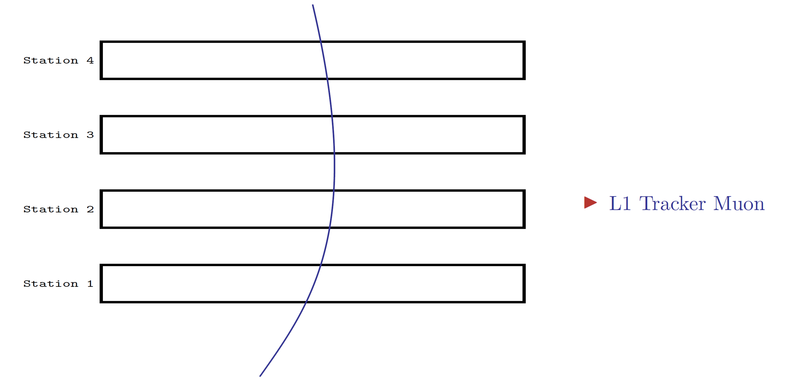
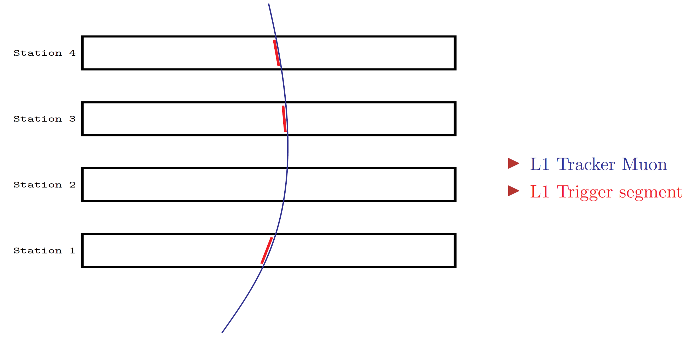
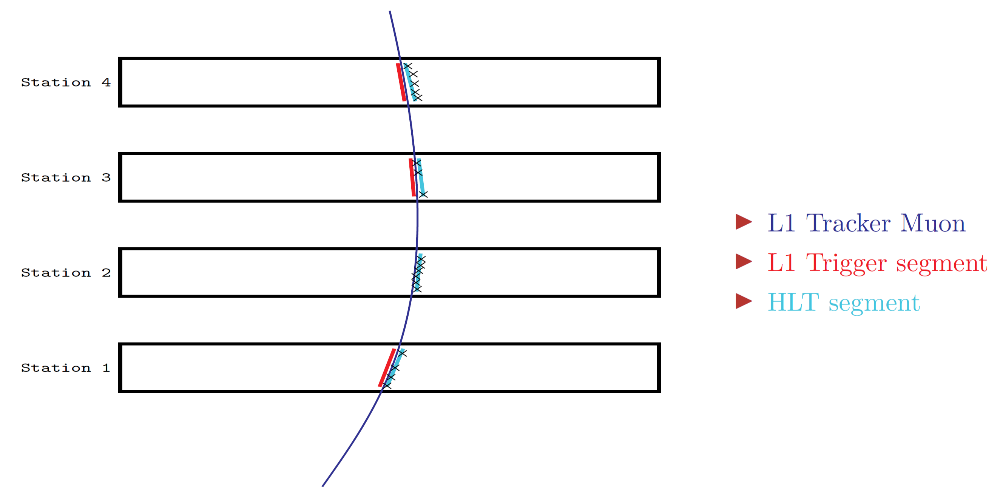
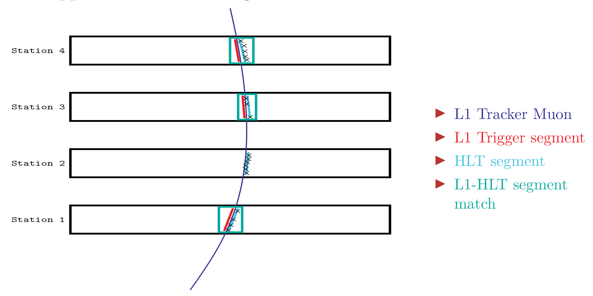
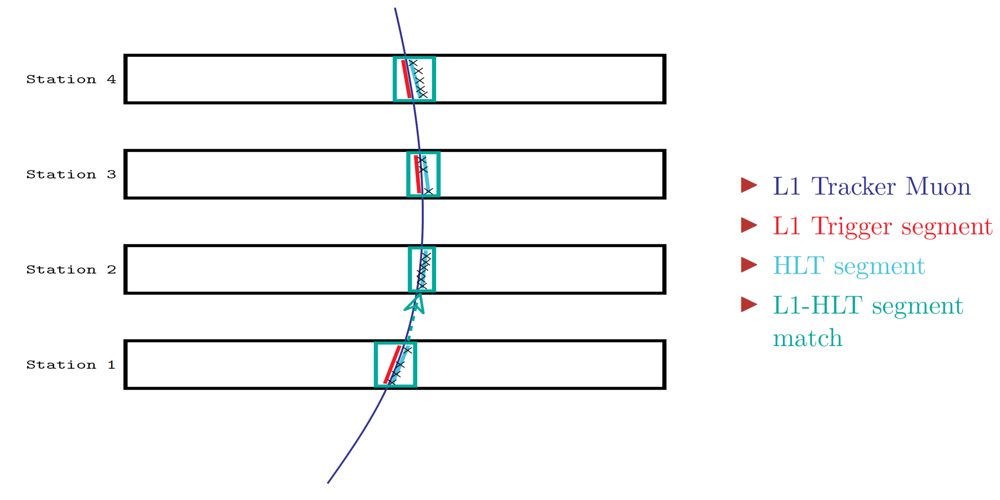

# A new approach to Standalone Muon seeding
Standalone Muons (L2) are tracks produced using hits and segments from the muon chambers only. The current strategy for Phase 2 uses two different seeds collection to produce Standalone Muons:

- seeds from L1Tk Muons: produced by extrapolating the L1Tk Muon information from the tracker to the second muon station
- "offline" seeds: produced using only information from the muon chambers 

These two collection of seeds are matched, merged, and the results is used as the input for the Standalone Muon track finding algorithm. 

The new Standalone Muon seeding approach produces a single collection of seeds by directly matching the stubs used to produce each L1 Tracker Muon (L1TkMu) with the HLT segments in the muon stations. The seeding procedure works as follows:

- It starts from the L1 Tracker Muon, CSC segments and DT segments collections found in the event
- The list of stubs used to create each L1TkMu is extracted and each stub is compared to all the HLT segments found in the same chamber (by `detId`)
- The highest quality segment match per chamber (based on $\Delta\phi$, $\Delta\theta$. highest number of hits in the most precise direction per chamber) is kept
- Specifically in the barrel region ($|\eta|$ < 0.8), it might happen that a chamber contains an HLT segment but not a L1 stub. In such cases, the seeder tries a simple extrapolation from the closest station with a match 
- Finally, all matched segments (at most one per Station) are added to the seed associated to the starting L1TkMu. This means that, at most, one seed is produced per L1TkMu

A schematic represantation of these steps is shown in the following figures:

/// caption
A L1 Tracker Muon traversing the CMS Muon system (consider the primary vertex in the bottom left of the picture)
///

/// caption
Stubs (or trigger segments) extracted from the L1 Tracker Muon
///

/// caption
View of HLT segments produced in the same chambers as the stubs
///

/// caption
HLT segments and L1 stubs are geometrically matched
///

/// caption
(barrel only) if a Station has no stub, a simple extrapolation is tried from the closest station with a good match
///

More implementation details can be found in [46897](https://github.com/cms-sw/cmssw/pull/46897). 
Since CMSSW_15_0_0_pre2, the new seeding approach is used by default in any `.777` or `.778` workflows. It can also be manually triggered by including the `phase2L2AndL3Muons` procModifier as a `cmsDriver` option. In this case, the second collection of seeds ("offline") is not produced and the single collection obtained in this way is used to seed Standalone Muons directly.